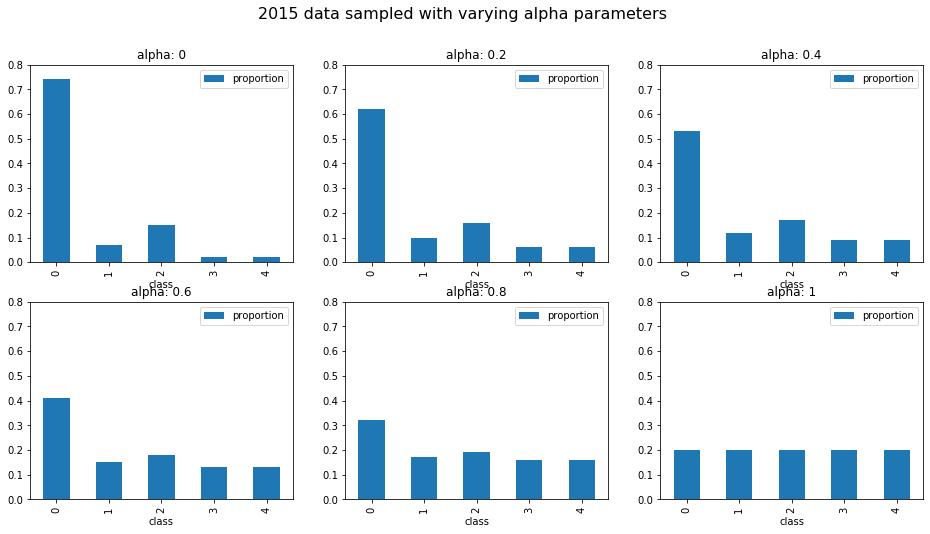

========================
pytorch_balanced_sampler
========================

PyTorch implementations of `BatchSampler` that under/over sample according to a chosen parameter
``alpha``, in order to create a balanced training distribution.

Usage
=====

SamplerFactory
--------------
The factory class constructs a ``pytorch`` ``BatchSampler`` to yield balanced samples from a
training distribution.

.. code::

    from pytorch_balanced_sampler.sampler import SamplerFactory

    # which sample indices belong to each of 4 classes
    class_idxs = [
        [1, 2, 3, 4, 5],
        [6, 7, 8, 9, 10],
        [11, 12],
        [13, 14, 15, 16, 17, 18, 19, 20]
    ]

    batch_sampler = SamplerFactory().get(
        class_idxs=class_idxs,
        batch_size=32,
        n_batches=250,
        alpha=0.5,
        kind='fixed'
    )

    dataset = Dataset( ... )
    data_loader = DataLoader(dataset, batch_sampler=batch_sampler)

    for data, target in data_loader:
        # nice balanced batches!
        ...

Class Balancing
---------------
Based on the choice of an ``alpha`` parameter in ``[0, 1]`` the sampler will adjust the sample
distribution to be between true distribution (``alpha = 0``), and a uniform distribution
(``alpha = 1``).

Overrepresented classes will be undersampled, and underrepresented classes oversampled. Here's an
example from an imbalanced data distribution I was working with a while ago:

Fixed Batch Distributions
-------------------------
If you select ``kind='fixed'``, each batch generated will contain a consistent proportion of
classes. Eg. if we have 5 classes, we might receive batches like:

.. code::

    Batch: 0
    Classes: [1, 0, 0, 0, 2, 4, 0, 2, 0, 0, 3, 2, 1, 0, 2, 0, 0, 3, 0, 0, 4, 4, 0, 2, 1, 3, 3, 1, 2, 0, 0, 4]
    Counts: {0: 14, 1: 4, 2: 6, 3: 4, 4: 4}

    Batch: 1
    Classes: [4, 1, 1, 2, 0, 0, 0, 4, 2, 4, 0, 3, 1, 3, 0, 0, 3, 2, 0, 2, 4, 2, 0, 0, 2, 3, 0, 1, 0, 0, 0, 0]
    Counts: {0: 14, 1: 4, 2: 6, 3: 4, 4: 4}

    Batch: 2
    Classes: [0, 4, 0, 0, 0, 3, 3, 2, 0, 4, 2, 3, 0, 3, 2, 0, 0, 1, 2, 2, 0, 1, 0, 0, 4, 0, 2, 1, 1, 4, 0, 0]
    Counts: {0: 14, 1: 4, 2: 6, 3: 4, 4: 4}

Note that the class counts are the same for each batch.

Random Batch Distributions
--------------------------
If you don't want to fix the number of each class in each batch, you can select ``kind='random'``,
which will use sampling with replacement. The samples will be weighted as to produce the target
class distribution *on average*.

Authors
=======
`pytorch_balanced_sampler` was written by `Karl Hornlund <karlhornlund@gmail.com>`_.
